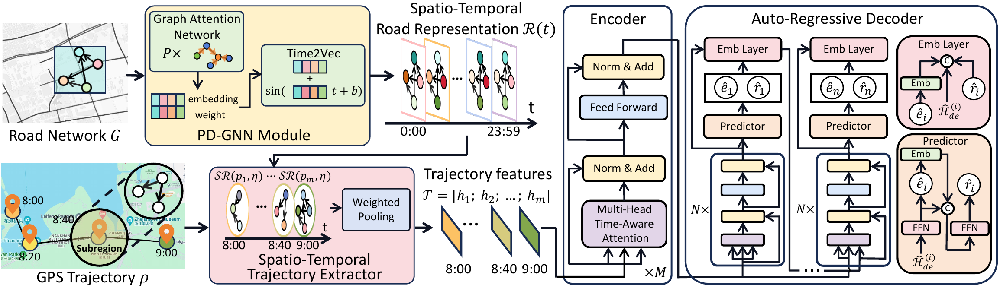

## TedTrajRec

### About
Source Code for [Learning Spatio-Temporal Dynamics for Trajectory Recovery via Time-Aware Transformer](https://arxiv.org/abs/2505.13857) 
Accepted as a journal paper in IEEE Transactions on Intelligent Transportation Systems (T-ITS)

### Problem Statement
In real-world applications, GPS trajectories often suffer from low sampling rates, with large and irregular intervals between consecutive GPS points. This sparse characteristic presents significant challenges for their direct use in GPS-based systems. The task of map-constrained trajectory recovery aims to enhance trajectory sampling rates of GPS trajectories, making them more useful for various applications.

### Model Architecture


The architecture of TedTrajRec consists of three main components: Feature Extraction, which involves the proposed PD-GNN for learning spatio-temporal traffic dynamics and a trajectory feature extraction module; Encoder, a time-aware Transformer, namely TedFormer that captures spatio-temporal trajectory dynamics of GPS locations within the attention mechanism; and Auto-Regressive Decoder, a decoder model that employs TedFormer and produces the target trajectory.

## Dataset and Data Format

### Map Data
Porto OSM Map is publicly available at
link: https://drive.google.com/drive/folders/11NPioTh20BcGpRMRy1efQk_LsxN3fj4f?usp=sharing

Map from OSM that contains: `edgeOSM.txt nodeOSM.txt wayTypeOSM.txt`. Other map format is preferred and `module/map.py`
need to be modified.

### Trajectory Data
Porto dataset is publicly available at
link: https://drive.google.com/drive/folders/1QNADHYKQNSo574S04iyOjh4LYySSpC2N?usp=sharing.

The dataset has the following format:

```
  .
  |____ train
    |____ train_input.txt
    |____ train_output.txt
  |____ valid
    |____ valid_input.txt
    |____ valid_output.txt
  |____ test
    |____ test_input.txt
    |____ test_output.txt
  |____ traj_input.txt
  |____ traj_output.txt
```

Note that:

* `{train_valid_test}_input.txt` contains raw GPS trajectory, `{train_valid_test}_output.txt` contains map-matched
  trajectory.
* The sample rate of input and output file for train and valid dataset in both raw GPS trajectory and map-matched
  trajectory need to be the same, as the down sampling process in done while obtaining training item.
* The sample rate of test input and output file is different, i.e. `test_input.txt` contain low-sample raw GPS
  trajectories and `test_output.txt` contain high-sample map-matched trajectories.
* `traj_input.txt` and `traj_output.txt` contain the whole dataset of raw GPS trajectory data and map-matched trajectory
  respectively before beding divided into train, valid, and test dataset.

## Usage

### Training
```
nohup python -u multi_main.py --city Porto --keep_ratio 0.125 --hid_dim 256 --dis_prob_mask_flag \
    --pro_features_flag --tandem_fea_flag --dgl_time_flg --decay_flag > porto_8.txt &
```

### Code Structure
* `module/time_aware_transformer_layer.py`: implement of Time-Aware Transformer.
* `model.py`: implement of TedTrajRec.
* `module/graph_func.py`: implement of graph functions.
* `module/map.py`: implement of map functions, i.e. calculating shortest path and r-tree indexing.

## Citation
If you find this code useful for your research, please cite our paper:
```
@ARTICLE{11034661,
  author={Sun, Tian and Chen, Yuqi and Zheng, Baihua and Sun, Weiwei},
  journal={IEEE Transactions on Intelligent Transportation Systems}, 
  title={Learning Spatio-Temporal Dynamics for Trajectory Recovery via Time-Aware Transformer}, 
  year={2025},
  volume={},
  number={},
  pages={1-18},
  keywords={Trajectory;Roads;Global Positioning System;Transformers;Hidden Markov models;Vehicle dynamics;Feature extraction;Computational modeling;Sun;Attention mechanisms;Trajectory recovery;spatio-temporal data mining;deep learning},
  doi={10.1109/TITS.2025.3574100}}
```
